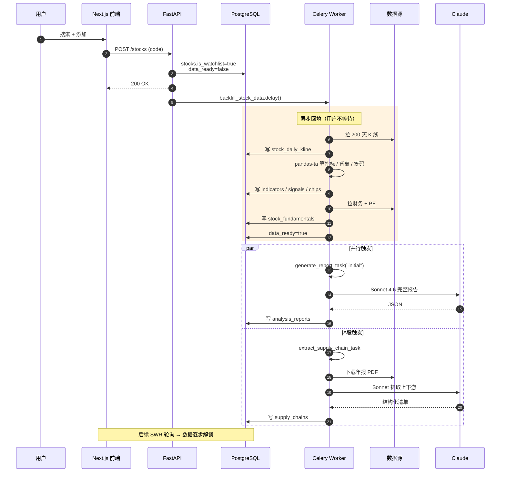
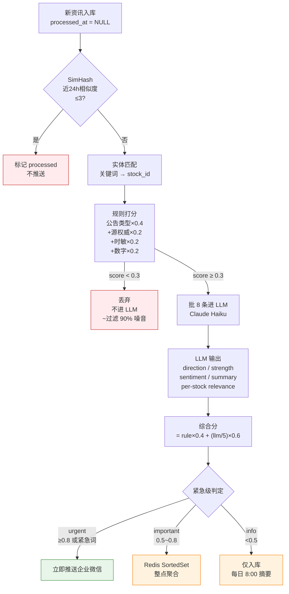
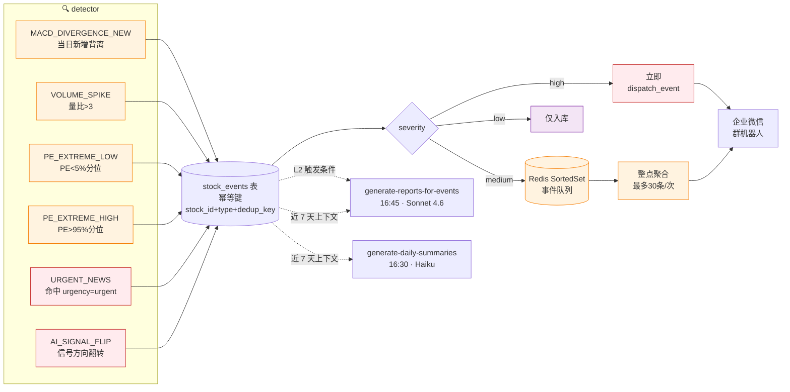
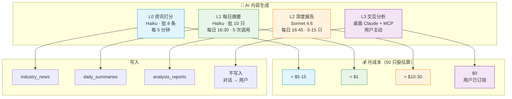

# MyStock 数据流单页图

> 一张图看清"数据从哪来 → 怎么处理 → 给谁看"。Mermaid 渲染，GitHub / VSCode / Claude 都支持。

## 全景：从数据源到用户的完整链路

```mermaid
flowchart LR
    %% ─────────── 数据源层 ───────────
    subgraph SRC["📥 数据源"]
        direction TB
        AK[AKShare<br/>K线/财务/资讯]
        TS[Tushare Pro<br/>盈利预测]
        FT[富途 OpenD<br/>港股实时]
        WSJ[wsj_cn]
        CLS[财联社]
        DISC[disclosure_em<br/>财报公告]
        EM[eastmoney<br/>个股资讯]
    end

    %% ─────────── 采集层 ───────────
    subgraph FETCH["🔄 采集 (Celery Beat)"]
        direction TB
        T_QUOTE["update-quotes<br/>每15s · 交易时段"]
        T_FUND["update-fundamentals<br/>每日 09:00"]
        T_KLINE["backfill_stock_data<br/>事件触发"]
        T_NEWS["crawl-news<br/>每3h"]
        T_DISC["crawl-disclosures<br/>每30m"]
        T_UNI["sync-stock-universe<br/>周日 02:00"]
    end

    %% ─────────── 存储层 ───────────
    subgraph STORE["🗄️ 存储"]
        direction TB
        subgraph PG[(PostgreSQL)]
            direction TB
            PG_M["stocks / aliases / universe"]
            PG_K["stock_daily_kline<br/>stock_technical_indicators<br/>chip_distributions<br/>divergence_signals"]
            PG_F["stock_fundamentals<br/>profit_forecasts"]
            PG_N["industry_news<br/>news_stock_relations"]
            PG_E["⭐ stock_events<br/>⭐ daily_summaries<br/>analysis_reports"]
            PG_S["supply_chains"]
            PG_CFG["app_settings"]
        end
        subgraph RD[(Redis)]
            RD_Q["行情 60s 缓存"]
            RD_KW["关键词词库 1h"]
            RD_QUEUE["事件/资讯<br/>聚合队列"]
        end
    end

    %% ─────────── 处理 / 分析层 ───────────
    subgraph PROC["⚙️ 处理 & 分析"]
        direction TB
        T_CALC["calc-indicators<br/>每日 16:00"]
        T_NEWSPROC["process-pending-news<br/>每5m"]
        T_EVENT["⭐ run-event-detection<br/>每日 16:15"]
        T_SUM["⭐ generate-daily-summaries<br/>每日 16:30 · Haiku"]
        T_RPT["⭐ generate-reports-for-events<br/>每日 16:45 · Sonnet"]
    end

    %% ─────────── 推送 / 交互层 ───────────
    subgraph OUT["📢 输出"]
        direction TB
        T_DISPATCH["⭐ dispatch-event-queue<br/>每整点"]
        T_DAILY["dispatch-daily-summary<br/>每日 08:00"]
        WX[企业微信<br/>群机器人]
        WEB[Next.js 前端<br/>Dashboard / 详情页]
        DESKTOP[桌面 Claude<br/>+ MCP postgres]
    end

    %% ─────────── 数据流 ───────────
    AK --> T_QUOTE & T_FUND & T_KLINE & T_DISC & T_NEWS
    TS --> T_FUND
    FT --> T_QUOTE
    WSJ & CLS & EM --> T_NEWS
    DISC --> T_DISC
    AK -.全量股票池.-> T_UNI

    T_QUOTE --> RD_Q
    T_FUND --> PG_F
    T_KLINE --> PG_K
    T_NEWS --> PG_N
    T_DISC --> PG_N
    T_UNI --> PG_M

    PG_K --> T_CALC --> PG_K
    PG_N --> T_NEWSPROC
    T_NEWSPROC -- "Haiku 打分" --> PG_N
    T_NEWSPROC -- "urgent 立即" --> WX

    PG_K & PG_F & PG_N --> T_EVENT
    T_EVENT --> PG_E
    T_EVENT -- "high 立即" --> WX
    T_EVENT -- "medium 入队" --> RD_QUEUE

    PG_K & PG_F & PG_E --> T_SUM
    T_SUM -- "L1 Haiku 批量" --> PG_E
    T_SUM -- "AI_SIGNAL_FLIP" --> WX

    PG_E --> T_RPT
    T_RPT -- "L2 Sonnet 4.6" --> PG_E

    RD_QUEUE --> T_DISPATCH --> WX
    PG_N --> T_DAILY --> WX

    PG_M & PG_K & PG_F & PG_N & PG_E & PG_S --> WEB
    PG_M & PG_K & PG_F & PG_N & PG_E & PG_S -. "只读 MCP" .-> DESKTOP

    %% ─────────── 样式 ───────────
    classDef source fill:#e3f2fd,stroke:#1976d2
    classDef task fill:#fff3e0,stroke:#f57c00
    classDef store fill:#f3e5f5,stroke:#7b1fa2
    classDef ai fill:#fce4ec,stroke:#c2185b
    classDef out fill:#e8f5e9,stroke:#388e3c

    class AK,TS,FT,WSJ,CLS,DISC,EM source
    class T_QUOTE,T_FUND,T_KLINE,T_NEWS,T_DISC,T_UNI,T_CALC,T_NEWSPROC,T_DISPATCH,T_DAILY task
    class T_EVENT,T_SUM,T_RPT ai
    class WX,WEB,DESKTOP out
```

⭐ = 本轮新增的事件总线 + AI 分级路径

---

## 一日时序（24h 调度甘特）

```mermaid
gantt
    title MyStock 自动调度时序（Asia/Shanghai）
    dateFormat HH:mm
    axisFormat %H:%M

    section 推送
    daily-summary 资讯摘要      :08:00, 1m
    dispatch-event 整点聚合     :crit, 09:00, 1m
    dispatch-event 整点聚合     :crit, 10:00, 1m

    section 数据采集
    update-fundamentals         :09:00, 30m
    update-quotes (每15s)       :active, 09:30, 5h30m
    crawl-news (每3h)           :09:00, 5m
    crawl-news                  :12:00, 5m
    crawl-news                  :15:00, 5m
    crawl-disclosures (每30m)   :09:30, 1m
    crawl-disclosures           :10:00, 1m
    process-pending-news        :09:05, 1m
    process-pending-news        :09:10, 1m
    process-pending-news        :09:15, 1m

    section 计算
    calc-indicators-daily       :16:00, 10m

    section AI 分析（核心链路）
    run-event-detection         :crit, 16:15, 5m
    generate-daily-summaries L1 :crit, 16:30, 5m
    generate-reports L2 Sonnet  :crit, 16:45, 15m
```



---

## 添加自选股的链路（事件驱动）



---

## 资讯流水线（process-pending-news 内部）



---

## 事件总线（5 类异常 → 推送路由）



---

## AI 分层与成本分布



---

## 双轨协同（自动监控线 ⟷ 交互分析线）

```mermaid
flowchart LR
    subgraph AUTO["🔁 自动监控线（Celery）"]
        A1[采集] --> A2[计算] --> A3[事件检测] --> A4[L1 摘要] --> A5[L2 报告]
        A5 -.> WX[企业微信告警]
    end

    subgraph DB[(PostgreSQL)]
        DB1[全部数据表]
    end

    subgraph INTERACT["💬 交互分析线（桌面）"]
        U[用户]
        DC[桌面 Claude]
        U <--> DC
    end

    AUTO --> DB
    DB <-. "只读 MCP" .-> DC

    WX --> U

    Note["典型流程：<br/>1) 16:30 推送收到 SIGNAL_FLIP<br/>2) 用户问桌面 Claude 'X 为什么翻转？'<br/>3) Claude 跑 5 个 SQL 整理出解释<br/>4) 用户做决策（系统不下单）"]

    classDef auto fill:#fff3e0,stroke:#f57c00
    classDef db fill:#f3e5f5,stroke:#7b1fa2
    classDef inter fill:#e3f2fd,stroke:#1976d2

    class A1,A2,A3,A4,A5,WX auto
    class DB,DB1 db
    class U,DC inter
```

---

## 字段引用速查

| 关键判断 | 涉及字段 | 来源表 |
|---------|---------|--------|
| 自选股过滤 | `stocks.is_watchlist = true` | stocks |
| 数据就绪 | `stocks.data_ready = true` | stocks |
| 资讯重要性 | `industry_news.importance_score` ∈ [0, 1] | industry_news |
| 资讯紧急级 | `industry_news.urgency` ∈ {urgent, important, info} | industry_news |
| 当日事件 | `stock_events.triggered_at::date = current_date` | stock_events |
| 事件未推送 | `stock_events.notified_at IS NULL` | stock_events |
| 当日 AI 信号 | `daily_summaries.signal` ∈ {bullish, bearish, neutral} | daily_summaries |
| 信号变化 | `daily_summaries.label_changed = true` | daily_summaries |
| 深度报告类型 | `analysis_reports.report_type` ∈ {daily, event_driven, initial} | analysis_reports |

详见 [mcp-data-dictionary.md](mcp-data-dictionary.md)。
